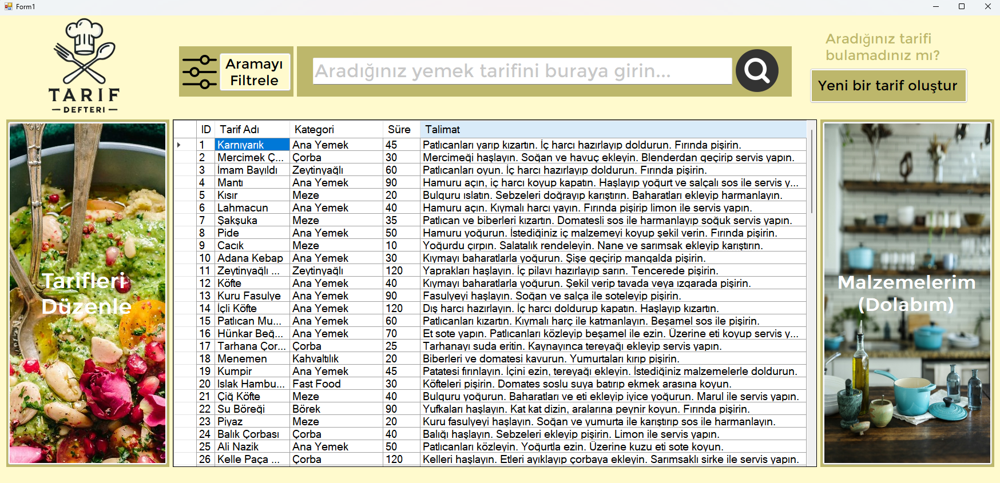
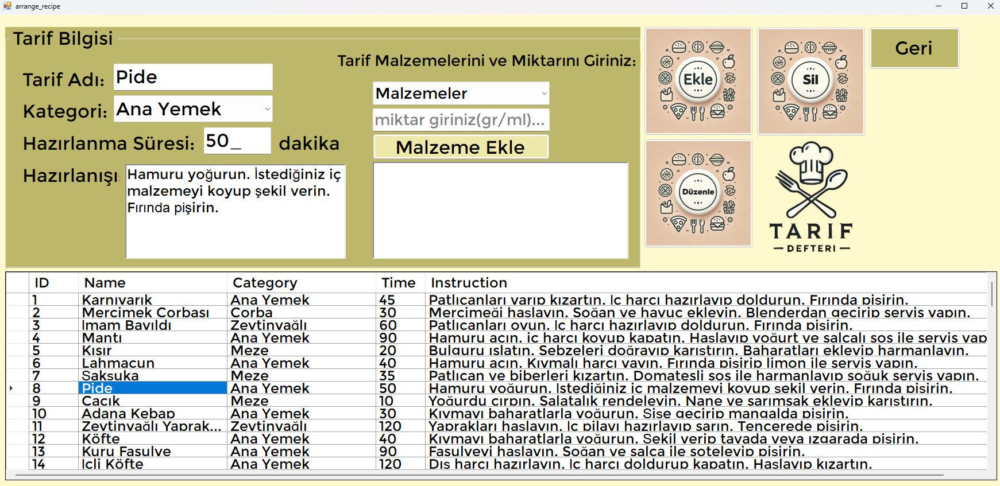
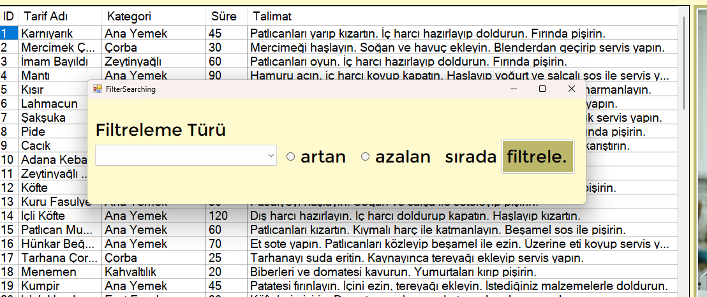
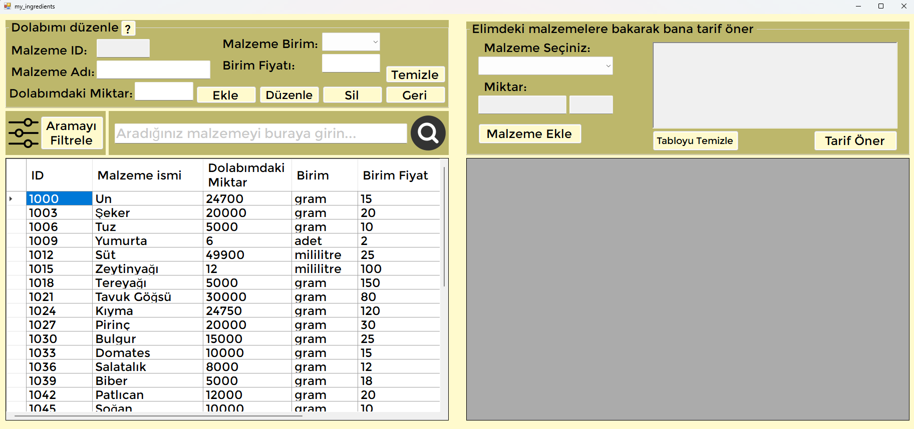
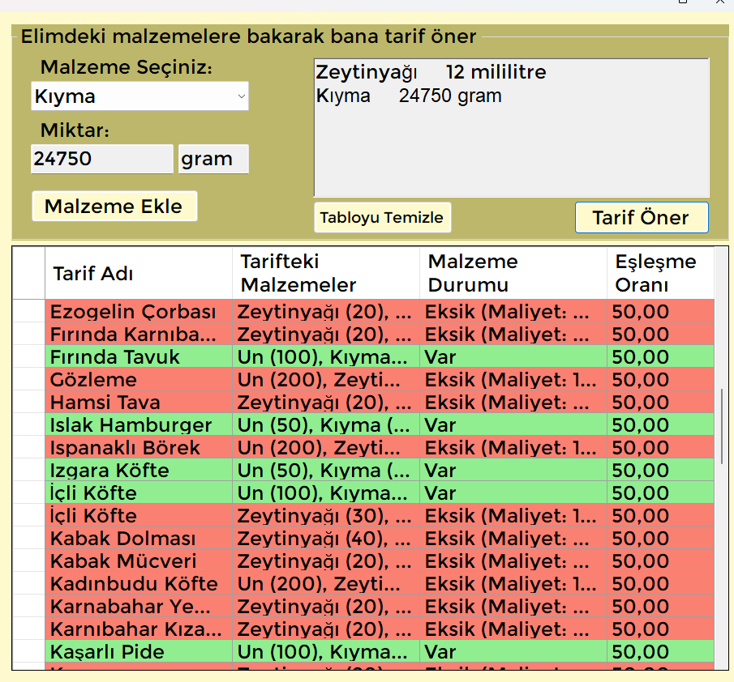
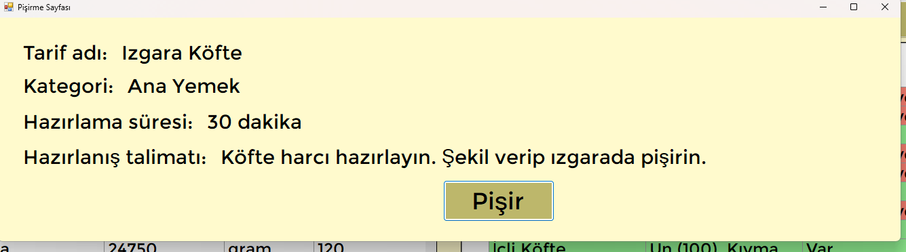

# Recipe App with SQL

This project is a *Recipe App* designed to manage recipes, including adding, editing and listing recipes. Users can add various recipes, edit existing recipes and list all recipes. The app includes details such as ingredient list, cooking instructions and recipe categories. This project was developed by two people (with:@Simsekomer/github).

## Features

- Recipe Management:
  - Add new recipes, delete and update existing recipes.
  - List and search recipes by categories.
  - Add cooking time, difficulty level and portion information for each recipe.

- Ingredient Management:
  - Add, delete and update ingredients required for recipes.
  - Track unit price and stock quantity for each ingredient.
  - Categorize and filter ingredients.

- Cost Calculation:
  - Determine the amount of ingredients used for each recipe.
  - Automatically calculate the total cost of the recipe.
  - Provide cost information per serving.


## Technologies Used
- *C#* with Windows Forms for UI.
- *MS SQL* for database management.
- Visual Studio* as development environment.

## Installation and Use

#### Requirements:
- Visual Studio
- MS SQL Server
- .NET Framework


#### Installation Steps:
1. Clone the project repository:
   ```bash
   git clone https://github.com/your-username/Recipe-Guide-Application-with-SQL-Data-Analysis-2.git
2. Create a new database in MS SQL Server and update the connection string in the project's configuration file.
3. Open the project in Visual Studio.
4. Run the project by pressing F5 or by running the following command in the terminal
   ```bash
   dotnet run

### Database Setup:
1. Create a database in MS SQL Server:
   ```bash
   CREATE DATABASE DbRecipeApplication;
   
2. Use the SQL script provided in the project to create the required tables.
3. Update the connection string in the app. configuration file.

### Photos


*Main Page where we can see the all recipes.*


*'Arrange recipes' page that appears after clickeing the 'Tarifleri Düzenle' button.*


*Filter Search tab that we can filter search.*


*'Arrange my fridge' and 'suggest me recipe' pages.*


*'Suggest me recipe' page that we can see situation of recipes*


*'Cook tab' that appears after clicking onto the recipe row*
